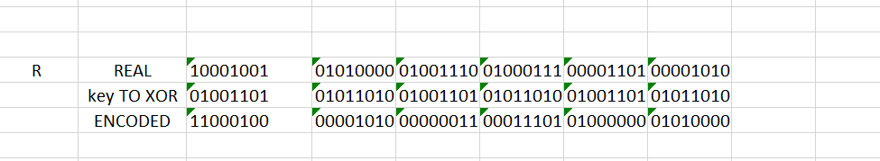

# metasploitCTF2020


This was the first CTF that my team 'LouisianaChowMein' played together. It was a lot of fun and a big learning experience. Working together is a lot more fun than I thought it would be, and I look forward to doing more team based CTFs. Overall, we scored 14th place out of the couple hundred(?) that got on the scoreboard.

# 3 of Spades


Someone else on my team popped port 25 and got hold of an /etc/passwd file, so I can't take credit for finding the hashes. They kindly dumped some of the cracked hashes in our shared channel.

### At this point, I kind of randomly just tried a few of the credentials 
on various services and hit one for port 22. Just a little credential spraying, I suppose. I actually forgot which one got the initial foothold, and my note taking wasn't that good so my apologies :(

### After logging into the box called 'finger' on port 22
I noticed, rather obviously, that there was a user 'ken' that had a home folder. After a bit of enumeration that did not turn up anything too interesting (*except for a mail daemon running localhost as root..*) I wanted to see what his shell was, so I had another look at /etc/password and noticed his last name 'Thompson'. That's pretty interesting, I thought. He created Unix. I remember reading a while ago that someone cracked his original password from a dump of a BSD source tree.

#### A google search revealed a page that listed his password:
https://thehackernews.com/2019/10/unix-bsd-password-cracked.html
Thompson's password has been revealed as "p/q2-q4!a"

### ... but it didn't work, and I felt dumb! I typically feel dumb
so that's not the issue. That *must* be it. This is a CTF, and surely they wouldn't troll this hard. I looked for other pages to see if maybe someone just put a wrong password out there. People make mistakes typing all the tmei. I quickly came across another page with the correct password due to my impressive google-fu:

#### I found a reasonable facsimile of the actual password
https://www.theregister.co.uk/2019/10/09/ken_thompsons_old_unix_password_cracked/
The page correctly revealed the password as "p/q2-q4!". Looks like someone just fat fingered an 'a' in the first page. Nice job, buddy :)

### After switching to 'ken' and rummaging through his personal stuff
I found what I throught was the 3_of_spades.png. I thought this because that was the name of the file. I took the md5sum of it and the metasploit CTF flag page was not happy. I was not happy. Never one to prematurely 'file' anything, I went back and did my file business. I 'file'd the heck out of that file, and it was 'data'. Crap. Must be encrypted, or maybe just be a sick joke. I tried a few of the common decryption methods with openssl and a few different passwords and tried using to root key from 'finger'. None of them worked. Next I created a little for/awk/sed/grep monstrosity loop in bash to grab all the openssl ciphers from openssl --help and try to decrypt it with a wordlist. Nothing worked and I kept getting an error about a magic number. It was taking too long anyway, so I figured that was a clue that dis was not dey way. 

### Other voodoo is necessary here. 
Side note, I also took a look at the file and noticed 'MZ' and thought it might be a mixed up DOS executable. I made a script to swap some bytes around just for the heck of it, but then my CTF brain told me to stop, there are no Windows boxes on this CTF.

I figured I'd read a little bit more about Ken Thompson and came across some random interview where he mentioned XOR. Ah that's nice. I remember doing this manually in a few years back in college. The next idea was to use xxd to dump out the binary for the first 8 or so bytes of a valid PNG file, and then do the same for the data file. I loaded up both in excel and proceeded to do the binary operations on each bit myself. It didn't take long, but the text was small and I was squinting and not really having a good time. Either way, once I was done and converted the new binary data to ASCII, it came out to "MZMZMZ..." Which was actually mentioned in the raw data file a few times, so this might have just been a clue, or a troll. Or both. I'll go with both.



### I spent the next 45 minutes looking for a tool to actually XOR the whole file with the key. 
I never had to do this on a CTF before and I couldn't find anything that actually worked. A few tools claimed to be able to do it, but none of the ones I tried spat out a readable file. I was probably using them wrong. Oh well. After some "XOR Online" google searches, I came across a tool called 'Cyberchef' that can not only decode a file you upload, given an XOR key, but it can actually find simple XOR keys like "MZMZMZ...". More time wasted, oh well. I came across CyberChef a while back, but it didn't enter my mind to use it. So, another lesson learned: You will quickly forget the best tool for the job. Once I XOR'd the file with CyberChef, the hash was accepted.

# Ace of Spades


### This card was also on 'finger'. 
While solving the previous card, I mentioned that this box had OpenSMTPD running on localhost as root. I circled back around to this and did a little google searching for vulnerabilities and hit a clear winner here: https://seclists.org/oss-sec/2020/q1/40. After verifying that the process was exploitable, I ended up using RCE to call a bash script that launced a reverse shell to my attacking machine, as root. It may have been possible to do inline, but there were a lot of issues with escaping characters that I did not want to deal with.

### I'm not actually sure 
that this particular file wasn't accessable by the previous guy, 'ken' or even the first guy I got the initial foothold with. Either way, it's nicer to to be root when checking the entire file system for something, so the first thing I did was create a script to run 'xxd' against all files on the drive, looking for the PNG header bytes. That's a lie, the first thing I did was type 'whoami' and had an exestential crisis for about 10 seconds. After that, I probably looked around for .png files and files with the names of card suits in them. Then I realised if I really wanted to find what I was looking for, I'd need to go straight for the file signature. Like any good scripter, I started writing a script and then thought, "I bet someone already did this..." and quickly found one that was already ready for use.

### A "script", the most primitive form of life.
#!/bin/sh

find / -type f | while read fname; do
  if hexdump -n8 "$fname" | grep -qF "0000000 5089 474e 0a0d 0a1a"; then
    echo "PNG MATCH: \"$fname\""
  fi;
done

### Oh... The script found an ASCII file
called /etc/flag. 'file' showed it as being plain ASCII and 'cat' returned the contents.

fingers# *cat /etc/flag*
```
00000000  89 50 4e 47 0d 0a 1a 0a  00 00 00 0d 49 48 44 52  |.PNG........IHDR|
00000010  00 00 01 0a 00 00 01 62  08 06 00 00 00 0e 6c 96  |.......b......l.|
00000020  fe 00 00 00 09 70 48 59  73 00 00 0d d7 00 00 0d  |.....pHYs.......|
00000030  d7 01 42 28 9b 78 00 00  80 00 49 44 41 54 78 da  |..B(.x....IDATx.|
00000040  ed 5d 77 5c 14 d7 13 ff  ee 15 ee e8 1d 14 45 8a  |.]w\..........E.|
00000050  0d 2b 60 57 50 11 7b 43  63 d4 68 d4 58 a2 c6 68  |.+`WP.{Cc.h.X..h|
00000060  34 1a 13 4b d4 18 13 eb  cf 68 2c 49 34 c5 c4 1a  |4..K.....h,I4...|
00000070  7b ef bd f7 5e 40 2c 58  50 51 91 de e1 ca fe fe  |{...^@,XPQ......|
00000080  38 38 6e ef 76 ef 76 ef  f6 0a 86 ef e7 93 c8 ed  |88n.v.v.........|
00000090  ce 7b 6f de bb bd d9 99  79 33 f3 08 92 24 49 94  |.{o.....y3...$I.|
000000a0  a3 1c e5 28 87 1e 08 ac  cd 40 39 ca 51 0e db 47  |...(.....@9.Q..G|
000000b0  b9 a0 28 47 39 ca 61 10  22 6b 0d 4c 92 72 28 49  |..(G9.a."k.L.r(I|
000000c0  25 48 52 01 92 54 02 50  5a 7b 2d 38 82 b0 62 d7  |%HR..T.PZ{-8..b.|
000000d0  dc c6 36 23 a7 bc 8e ca  a9 05 2f 93 b2 dc ca b0  |..6#....../.....|
000000e0  1b 89 00 08 01 08 08 40  10 02 d8 d2 7b dc 22 82  |.......@....{.".|
000000f0  42 49 ca 21 93 e7 40 26  cf 81 42 51 00 b9 b2 10  |BI.!..@&..BQ....|
```

### I see columns, I load it up in Notepad++
and used Column mode to quickly remove the addressing, extra spaces and the ASCII column. All we want here is the hex values. I didn't know of another way to do this at the time, so this seemed like the quickest route since I was running Kali in a VM on a windows Box. The result was something like this:

```
89 50 4e 47 0d 0a 1a 0a 00 00 00 0d 49 48 44 52
00 00 01 0a 00 00 01 62 08 06 00 00 00 0e 6c 96
fe 00 00 00 09 70 48 59 73 00 00 0d d7 00 00 0d
d7 01 42 28 9b 78 00 00 80 00 49 44 41 54 78 da
ed 5d 77 5c 14 d7 13 ff ee 15 ee e8 1d 14 45 8a
0d 2b 60 57 50 11 7b 43 63 d4 68 d4 58 a2 c6 68
34 1a 13 4b d4 18 13 eb cf 68 2c 49 34 c5 c4 1a
<removed>
```

I then used used 'xxd' to convert the hex output back into binary after exfiltrating it to my own machine
*kali:$ xxd -r flag > ace_of_spades.png*

The resulting md5sum of the png was accepted without further manipulation, which was nice.

# 7 of Diamonds


# Another flag was on finger!
This was a bit tougher to solve. Probably more of a middle-finger, right? RIGHT???

### Anyway, the root folder had file called 'hai'. 
That's cool. How are you? I'm fine. I greeted the it with 'file' and it said it was a 'git bundle'. Nice to meet you, sir or madam. I never heard of it so had to do some research. Turns out it was easy enough to extract.

*kali:$ git clone ./hai unbundled*

Inside of the un-bundled repo main directory, there was a file called 'whats-this'. Indeed, whats-this?

*kali:$ file whats-this*
whats-this: PNG image data, 266 x 354, 8-bit/color RGBA, non-interlaced

### Nice, that was easy.

No it wasn't. This is a ruse. A horrible, evil ruse. It's just half of a card! I had a chuckle at this.


At this point I moved on to make more progress on some of the other cards that I may or may not have already mentioned. Once I came back and realized "Yes, the other pieces must be in the bundle" I was able to start digging further into the trenches of git objects, blobs, hashes, and commits.

### Take a look at .git/config

There is another branch listed called 'nothing-to-see-here' mentioned in the config file. I took note of that for later. I'm no betting man, but I bet to myself, 'self, I bet that there IS something to see there'. For now, I wanted to check through the 'master' branch and see if there were any other clues. I tried 'git log' but there was only one commit for master. Next I did a  'git rev-list --all' and it showed more hashes so there was obviously more stuff here.

### Must be some blobs and trees?

*kali:$ git cat-file --batch-check --batch-all-objects --unordered*

A snapshot of the output looks like this, with a few dozen hashes:

```
c3766bf7c1b61f2dc1a97e04b9b0af4b916ae417 commit 268
eff56ac36868bf16d510fd5b8b9efa7fae46215f commit 270
58edfba5346925bf6944c456b668ddc6d868c31b commit 272
130ebebdc271768c807c9f25eb89fdaf8904e0b9 commit 282
3d5e264d116a40cddc4f00bb7d536d9cafb59a50 commit 274
ef9e97776f6ae35b18c900f2dbe8ec3239fbc25d commit 276
b2427cb016aeece6c01c33cf990cf63875b9dbae commit 278
b1807dff8f4978f0ffcfd24f7834e536db8c11c4 commit 280
078859f48e777e35ee75c7880c8cb5eb1d03f667 commit 285
7cadeef01e867da960cae432000796879b77f59a commit 12608
43c64a23120e28abdd39ef66f6a0927fc07d23dc tree 38
edc50ccca8bae273bec5e33feb2b8db170431cec blob 18364
7b836bb1b0227b82fe34a8570b6bd4e9b28b0c87 tree 38
48e68b614bc7e8229a876b7b447bc6ea512349cc blob 9182
<more hashes>
```
### Looking at the hashes

I created a quick 'for loop' to show the contents of all the hashes with 'git show', hoping something interesting would
pop out. Two of the hashes in this branch (the two starting with edc50 and 48e6) had some interesting content that looked like "part of a file, maybe".

I saved edc50_masterbranch.blob and 48e6_masterbranch.blob and then moved on to the 'nothing-to-see-here' branch. It had the same two hashes, and after saving the files and running 'diff' against them and the files from the master branch, showed that they were the same.

### The final(?) piece

The last piece of the PNG was in the commits inside of the 'nothing-to-see-here' branch. After a bunch of spam commits, there is one in particular with a bunch of base64 that was shown with a simple 'git log' command.

```
Commit 078859f48e777e35ee75c7880c8cb5eb1d03f667
Author: Your Name <you@example.com>
Date:   Mon Jan 27 17:57:37 2020 -0500

    ARE YOU READING LOG MESSAGES?  WHAT COULD POSSIBLY COME OF THAT? . . . . . . . . .

commit 7cadeef01e867da960cae432000796879b77f59a
Author: Your Name <you@example.com>
Date:   Mon Jan 27 17:57:37 2020 -0500

    ZNKdfmDCZKZ/CEwhsHmiwHzUHfTOg7C2bsovRQEC02uI8CY8GonUf7CTPge1ZRfYkZ+4H7bHHl3/
    lQXpIDQU5C6wnHj04Al2bD+A+3cfISYmDmYz/8Gsn48ZhBKli/KobVOUkrjXQwkCUwjMqE/AVq2Y
    mrWpYF6HnwhMYlStCHbqOKB2NfGjDlQCMxNA5uP65fMm1q7eim+++jl1h6h7JAidlchLZvqZwBRC
    vjyw9hI41chLLkguAtPbnAn3Qh14m3GfuunPsxZZ5kF+EBgK3xGYaXh4/4ndSETlikSjxrURlSsS
    Wi1/Zl6Bgh4OcLEbCtKQQwaIeLu5NTU+zZkglCgXgSlny0AnMDM4JHsUShCYadi75wgsFgbFShTG
    slVzEBQc5Ob34uZrL3GbuS8ITN8hwAlMUdKzQg5/wcPyqH8IzBfPXwEA3m7V2L2R8NihY+gRWAQm
    fzuFcibkhAIEplxaZ5kH5UB0cA3fR7EQ0zw8MgwAkPQmSdQqh0t/Ei4A8iWB6baenDkTgU5gihmE
    x7FlmQslIHqvh3T7T0qoUWjevAFUahr/HjlFRGYKaSQ2lJY/5BAjRe5W5POthI7yehNZP35/Qyj3
    mfej9JBDHAoVzo/PPv8E3383F316DUev3u+gaNFoBAXreYVG5YqETqfl6Tgt9CBRTokvY0YgMEkF
    yJWBKaOOWd6Ez8BjKBT8wYh4u7Xr2AzbtuzB+XNXcP7cFbetFiz7GdWqV3DpQgyZKTXk+E8QmN5u
    +vKiVhaBGRjwvOrhIwLTEWazBQP6jsGVyze8G50nQ+GnnAmfEJh++d1kEZiZFe4NhQ9yJvhq79l1
    CFcu3wBN0/jwoy5o1qIBcudJCy9cpYaknhrk8gNMCz3EXmcuFornTCjxQ5Lbm/Bh6JYZQo4ZvwC3
    <removed>
```

### Putting them together
was fairly simple. The 'whats-this' file from 'master' was the first piece since it had the file signature on it, and the last piece was the base64 decoded part retrieved from the 'nothing-to-see-here' branch. It had the typical ending of the flags, which was metadata about the image. It also had IEND, which all PNGs have. The final, middle piece, (assuming it was the 'only middle') was placed in the middle. The files were stiched together quicky with 'cat' and the hash submitted successfully.

*kali:$ cat whats-this.master whats-this.nothing b64_decoded.commit > 7_of_diamonds.png*


# 10 of Hearts


### Care for a mount?

This service was running on port 564 and nmap showed the protocol being 'p9fs' or something similar. Turns out it was Plan 9 File System. A teammate of mine found the initial foothold here by mounting the drive with:

*kali:$ mount -t 9p 172.16.26.37 /mnt/9*

The mounted directory showed a 33 byte file called 10_of_hearts.png, but if you tried to see the contents, it would give you one of a few messages like:

"stop reading so fast..."
"Whoa speed reader, slow down"
"Slow down and enjoy a good read."

My teammate asked me to take a look, so I did. I immediately thought of a file stream due to the different messages and the low file size. We played around with 'head' and 'tail' for a little bit, 


Tail was showing the very end of a PNG file. We then tried 'head -c 100' and narrowed in on 'head -c 1050' which was the maximum amounts of bytes that could be read from the stream at once. This showed the typical PNG signature. So we were getting close.

After coming up with the idea to take the message literally and 'slow down', I looked for ways to read byte-by-byte. I tried to read with python and a few tries in bash, but I was still getting the message back. After realizing that I might be able to read the mount point like a disk, byte-by-byte with 'dd', I looked up how to do that and eventually came up with the command:

*kali:$ dd if=/mnt/9/10_of_hearts.png seek=0 bs=1 count=100000 > 10_of_hearts.png*


